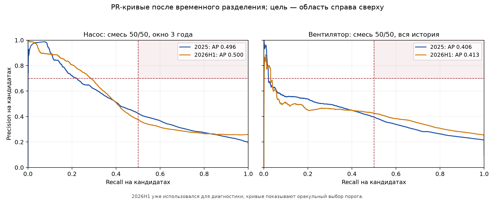

# Продолжение исследования метрик, 24 сентября 2026

## Протокол

Исходная выгрузка и контрольные суммы — [dataset_manifest.sha256](dataset_manifest.sha256), файлы событий хранятся вне Git. Python 3.12, CPU.

**Цель:** для каждого канала насоса или вентилятора оценить в момент кандидата вероятность начала следующего эпизода состояния «Неисправен» в `(t, t+72 ч]`. Разрыв между эпизодами — более 6 ч. Это метка состояния канала, а не подтверждённый физический отказ. Признаки строятся по событиям, доступным не позже `t`; новые счётчики состояний и предыдущее состояние в опытах использовали строго `event_ts < t`. Для события с тем же временем действует описанное в [первом отчёте](metric-improvement-2026-09-24.md) предположение о пакетной доступности за секунду.

Это допущение существенно для потокового переноса. На 2025 у `34 281` из `238 073` кандидатов насоса (`14,4%`) и `24 913` из `208 325` кандидатов вентилятора (`12,0%`) в ту же секунду на канале было более одного **различного состояния**; на 2026H1 — `26 044/263 612` (`9,9%`) и `17 999/219 377` (`8,2%`). Среди положительных кандидатов вентилятора 2026H1 таких `7 298/20 168` (`36,2%`). Это не доказывает утечку при принятом пакетном протоколе, но при обработке событий по одному внутри секунды признаки и метрики нужно пересчитать с доступностью строго до конкретного события. Ни один вариант из этого отчёта не проверен в таком режиме.

Разработка — 2024 (обучение до 2023), подтверждение — 2025 (обучение до 2024), диагностика — 2026H1 (обучение до 2025, последние 72 ч исключены). Перед каждым годом проверки действует зазор 168 ч. Масштабирование и параметры моделей обучаются только на прошлом. Порог для проверки переносится из предыдущего года без подбора на проверяемом. Модель насоса из первого отчёта — смесь 50/50 логистической регрессии и компактной LightGBM на трёх последних годах; её метрики служат контрольной линией. Для вентилятора контрольная линия — логистическая регрессия на всей доступной истории.

Результаты 2025 уже участвовали в предыдущем исследовании, а 2026H1 был открыт для диагностики. Поэтому ни один из этих периодов не является полностью скрытым независимым тестом для новых гипотез. После множества проверок на 2024/2025 небольшие выигрыши особенно нуждаются в новой независимой выгрузке. В Git попадают только код и агрегированные показатели; строки событий, адреса каналов и построчные оценки остаются в игнорируемом `analysis/`.

Дополнительный ретроспективный backtest фиксированных семейств моделей на 2022–2023 (обучение только на предшествующих годах с тем же разрывом 168 ч) показал: у насоса AP линейной модели/смеси `0,360/0,380` на 2022 и `0,368/0,373` на 2023; у вентилятора `0,352/0,404` и `0,278/0,287`. Выигрыш AP смеси был положительным и в ранние годы, но **перенос численного порога из 2022 на 2023 провалился**. После исключения первых 72 ч 2023 точность/recall насоса для смеси составили `0,486/0,152`, вентилятора — `0,483/0,010`; у линейной модели вентилятора при её пороге вообще не было тревог. Эти годы являются ретроспективной проверкой устойчивости, а не новым независимым тестом после выбора моделей.

## Исправления корректности

- В `pipeline/features.py` скорректирован `channel_failure_prior` для каналов без предыдущих эпизодов: знаменатель теперь использует возраст наблюдений **в момент кандидата**, а не среднее по всей будущей истории канала. У насоса 1 878 925 строк признаков после пересчёта совпали побитово со старым кэшем; у вентилятора изменились 1 078 648 из 2 103 615 строк на 119 каналах. Исследования вентилятора ниже пересчитаны на исправленном кэше. Регрессионный тест проверяет, что добавление будущего эпизода не меняет признаки текущего кандидата.
- В `pipeline/formal/metrics.py` достижение формальной цели определяется строгими `Precision > 0,70` и `Recall > 0,50`, как требует постановка. Равенство больше не считается успехом; расчёт при фиксированном пороге теперь содержит TP, FP и FN. Численные оценки моделей этим изменением не меняются.

## Насос: проверенные гипотезы

| Изменение | AP 2024, контроль → вариант | AP 2025, контроль → вариант | Итог |
| --- | ---: | ---: | --- |
| Равный вклад эпизодов в положительные примеры, степень 0,5 | 0,479 → 0,385 | Не переносили | Значительное ухудшение ранжирования |
| Причина появления кандидата как one-hot признаки | 0,479 → 0,485 | 0,496 → 0,494 | Не подтвердилось |
| Возраст истории канала | 0,479 → 0,463 | Не переносили | Отклонено |
| Последнее строго предыдущее состояние | 0,479 → 0,475 | 0,496 → 0,485 | Отклонено |
| Счётчики прошлых состояний за 24 ч и 7 дней | 0,479 → 0,504 | 0,496 → 0,490 | Сильный выигрыш разработки не перенёсся |
| Вспомогательный target на 24 ч, вес 0,25 | 0,479 → 0,479 | 0,496 → 0,477 | Отклонено |
| Нормализация оценки по медиане канала из train, сила 0,25 | 0,479 → 0,467 | Не переносили | Отклонено |
| Смесь логарифмов шансов вместо среднего вероятностей | 0,479 → 0,484 | 0,496 → 0,500 | Малый выигрыш AP; см. перенос порога |
| Фаза между отказами как три дополнительных признака | 0,479 → 0,484 | 0,496 → 0,500 | Малый выигрыш в основном в I полугодии |
| Фаза между отказами только в I полугодии | 0,479 → 0,484 | 0,496 → 0,501 | Исследовательский вариант; интервал неопределённости включает ноль |
| LightGBM: 15 листьев, ≥1000 записей на лист | 0,479 → 0,493 | 0,496 → 0,502 | Улучшение 2024/2025, регрессия AP на 2026H1 |

У фиксированного порога, выбранного на 2024, сезонная фаза дала на полном 2025 `P=0,718`, `R=0,225` (TP 10 133, FP 3 979, FN 34 862) против `P=0,704`, `R=0,216` у контрольной смеси. Однако парный bootstrap 2025 после исключения первых 72 ч (1 822 кандидата) дал 95% интервал прироста AP `[-0,0035; +0,0131]` по неделям и `[-0,0025; +0,0097]` по каналам; интервалы для прироста precision/recall также включают ноль. На диагностическом 2026H1 AP снизился с 0,500 до 0,498, хотя recall при перенесённом пороге вырос с 0,255 до 0,262 при `P=0,733`.

Дерево 15/1000 на 2025 при пороге из 2024 дало `P=0,701`, `R=0,234` против `0,704/0,216`; запас по precision мал. На 2026H1 AP снизился с 0,500 до 0,484, а recall при пороге 2025 — с 0,255 до 0,234. Смесь логарифмов шансов на 2025 при перенесённом пороге дала `0,712/0,213`; на 2026H1 — `0,727/0,266` против `0,744/0,255` у текущей смеси. Недельный bootstrap прироста AP 2025 для этого способа смешивания: `[-0,0005; +0,0089]`. Ни один вариант не достигает одновременно строгих 0,70/0,50 и не заменяет сохранённый исследовательский артефакт насоса.

Снятие `class_weight="balanced"` только с дерева дало смеси насоса AP `0,480` против `0,479` на 2024; при этом R@P≥0,70 снизился с `0,193` до `0,180`. На 2025 AP вырос с `0,496` до `0,501`, а при пороге из 2024 получились `P=0,723`, `R=0,232` против `0,704/0,216`. Но на 2026H1 AP упал с `0,500` до `0,489`, а при пороге из 2025 precision снизился с `0,744` до `0,693` при росте recall `0,255→0,270`. Ретроспективные срезы 2022/2023 тоже против снятия балансировки: AP смеси `0,352/0,367` против `0,380/0,373` у сбалансированного дерева. Ограниченная сетка веса дерева `0,25/0,50/0,75` на 2024 не дала варианта с лучшим R@P≥0,70, чем исходная сбалансированная смесь 50/50. Вариант без балансировки не выбран.

Предварительно заданное неглубокое регуляризованное XGBoost (глубина 2, 300 деревьев, `min_child_weight=100`) на 2024 также не превзошло текущую смесь: AP самой модели `0,441`, смеси с линейной моделью при весах дерева `0,25/0,50/0,75` — `0,469/0,462/0,453` против `0,479` у текущей LightGBM-смеси. R@P≥0,70 у лучшего по AP варианта XGBoost равен `0,140` против `0,193`. На 2025 его не переносили.

Охват генератора кандидатов задаёт верхнюю границу episode recall: за 72 ч перед отказом есть хотя бы один кандидат у 3 732 из 4 318 эпизодов 2024 (86,4%) и 3 478 из 4 048 эпизодов 2025 (85,9%). При *причинном* пороговом оповещении с cooldown 24 ч низкий порог 0,5332 на 2024 обнаружил 53,3% эпизодов, но дал лишь 28,5% точных тревог и 35,8 тревоги/день. Порог 0,8593 дал 69,1% точных тревог при охвате 3,9% и 0,61 тревоги/день; без пересчёта на 2025 — 66,8% и 4,3%. Повышение cooldown до 48–168 ч не улучшило совместно точность и охват. `daily top-1%` в старых отчётах остаётся **ретроспективной** метрикой ранжирования, поскольку выбирает лучшие оценки после получения всех кандидатов дня; его нельзя считать проверкой потоковых оповещений.

Чтобы проверить провал смеси на новых каналах, в трёх опытах исключали случайные 20% каналов из supervised train до 2024 и **обнуляли их историю событий с 1 января 2024**. Кандидаты и признаки за первый месяц строились заново из укороченной истории. Разница AP смеси относительно линейной модели по seed 42/7/2026 составила `−0,086/+0,041/+0,030` на 1 832/1 657/2 073 кандидатах. Сегменты различались долей положительных примеров, а группы каналов могут пересекаться. Это более близкая имитация короткой истории, чем прежний group holdout без обнуления, но она **не подтверждает универсальный fallback** на линейную модель. Популяционные априорные частоты при пересборке оставались рассчитанными по исходной обучающей выгрузке, поэтому имитация не полностью идентична появлению нового оборудования.

Как отдельная диагностика, правило «для истории <30 дней использовать линейную модель, иначе смесь» на 2025 подняло AP новых каналов с `0,494` до `0,593`, общий AP с `0,496` до `0,497` и precision при пороге из 2024 с `0,704` до `0,722`. Общий candidate recall при этом снизился с `0,216` до `0,212`. В 2024 не было каналов с историей <30 дней, а в доступном 2026H1 новых каналов такого возраста тоже нет; проверка 2025 уже мотивировала эту гипотезу. Поэтому результат не служит независимым основанием для включения fallback.

## Вентилятор после пересчёта признаков

Контрольная логистическая модель дала AP `0,305/0,395/0,339` в 2024/2025/2026H1. Простая смесь 50/50 той же линейной модели и компактной LightGBM, обе на всей прошлой истории, дала `0,315/0,406/0,413`; episode recall при дневном top‑1% и cooldown 24 ч вырос с `0,069/0,052/0,064` до `0,095/0,070/0,094`. Это улучшение **ранжирования** и ретроспективного отбора, а не прохождение формального порога.

В течение 72 ч до эпизода есть хотя бы один кандидат у `3 926/4 327` эпизодов 2024 (90,7%), `4 741/5 143` эпизодов 2025 (92,2%) и `3 123/3 297` эпизодов доступного 2026H1 (94,7%). Генератор даёт достаточно точек для существенного роста episode recall; основной провал происходит при ранжировании и отборе тревог.

Порог смеси из 2024 на 2025 дал `P=0,666`, `R=0,028`, а порог из 2025 на 2026H1 — `P=0,368`, `R=0,00035` всего при 19 срабатываниях. Шкала оценки заметно изменилась; перенос численного порога ненадёжен. Недельный bootstrap разницы AP в 2025: `[-0,025; +0,032]`, по каналам: `[-0,018; +0,037]`. На диагностическом 2026H1 соответствующие интервалы составили `[+0,029; +0,106]` и `[+0,040; +0,085]`: прирост ранжирования на этом срезе устойчив к двум способам пересэмплирования, но период уже использовался при выборе гипотез, а блоки не учитывают все общие причины отказов. Поквартально смесь проиграла контрольной модели в IV квартале 2024 (`−0,024`) и I квартале 2025 (`−0,058`), но выиграла в остальных кварталах 2024/2025 и обоих кварталах доступного 2026H1. Результат требует последующей независимой проверки и отдельной калибровки порога до применения.

Для проверки потокового применения использован **численный порог**, равный 95-му перцентилю оценок каждого варианта в 2024, и cooldown 24 ч для каждого канала. На 2024 линейная модель дала 6,55 тревоги/день, точность тревог `0,478` и охват эпизодов `0,157`; смесь — 5,96 тревоги/день, `0,517/0,170`. Те же пороги без перенастройки в 2025 дали 10,27 тревоги/день, `0,369/0,182` для линейной модели и 10,45 тревоги/день, `0,411/0,212` для смеси. Парный bootstrap по 354 каналам в 2025 для разницы смеси с линейной моделью дал 95% интервалы `[-0,004; +0,099]` по точности тревог и `[+0,021; +0,040]` по охвату эпизодов. Каналы могут иметь общие внешние причины отказа, так что эти интервалы не учитывают всю зависимость данных. Обе модели остаются далеко от `P>0,70` и episode recall `>0,50`; частота тревог между годами тоже не фиксируется одним численным порогом. Перцентиль выбран по всему 2024, поэтому это ретроспективная настройка для 2025, а не внутригодовая online-калибровка.

Помесячный replay тех же **замороженных** порогов выявил серьёзную неоднородность. В июле 2025 смесь при 685 тревогах достигла точности `0,594` и охвата `0,473` против `0,561/0,361` у линейной модели при 597 тревогах. Но в октябре 2025 у смеси **0 точных тревог из 32** и обнаружен лишь 1 из 251 эпизода; у линейной модели — точность `0,194` при 72 тревогах и 10 обнаруженных эпизодов. В марте 2026 точность смеси тоже ниже: `0,097` при 216 тревогах против `0,155` при 71 тревоге. Годовой выигрыш не означает пригодность порога для каждого месяца. Эпизод относится к месяцу начала отказа, а своевременная тревога могла прозвучать в предыдущем месяце.

Пороги 95-го перцентиля уже **2025** при переносе на 2026H1 дали линейной модели 9,19 тревоги/день, точность `0,434`, episode recall `0,164`; смеси — 12,27 тревоги/день, `0,462/0,226`. Интервал разницы по каналам составил `[-0,052; +0,107]` для точности и `[+0,048; +0,074]` для episode recall. Здесь смесь выдаёт на треть больше тревог, поэтому прирост охвата нельзя приписать одной только модели при равном бюджете. Это диагностика уже открытого периода, не новая независимая проверка. Численный порог строгой цели по candidate recall, перенесённый отдельно, всё равно даёт почти нулевой охват 2026H1.

Проверен и причинный порог по 95-му перцентилю **только прошлых 30 или 90 дней оценок**, обновляемый перед каждым днём без меток будущего. На 2025 у смеси статический порог дал `P=0,411`, episode recall `0,212`, 10,45 тревоги/день; окно 30 дней — `0,432/0,192`, 8,46 тревоги/день; 90 дней — `0,437/0,183`, 7,86 тревоги/день. На 2026H1 соответствующие значения — `0,462/0,226` при 12,27, `0,471/0,217` при 12,54 и `0,487/0,169` при 8,75 тревоги/день. Адаптация улучшала точность ценой охвата и не стабилизировала частоту тревог между периодами. Это исследовательская диагностика, не автоматическая калибровка для применения.

На отдельных каналах выигрыш менее однороден, чем в общем AP: в 2025 AP вырос у 105 из 232 каналов с достаточным числом кандидатов и обоими классами, снизился у 127; медианный прирост `−0,002`. По календарным неделям выигрыш был у 34 из 53, медианный `+0,0067`. В 2024 каналов с положительным/отрицательным приростом было `109/100`, в 2026H1 — `119/115`; недель с положительным приростом — `37/53` и `20/26`. Общий выигрыш совместим с улучшением ранжирования **между** каналами, но не доказывает улучшение на каждом канале.

После исправления признака повторены варианты временного окна: AP логистической модели на 2024 `0,305` для всей истории, `0,331` для одного года, `0,293` для двух, `0,281` для трёх, `0,309` для затухания с полупериодом два года и `0,314` без календаря. На 2025 соответствующие значения `0,395/0,352/0,382/0,431/0,406/0,388`; ни один вариант, выбранный по 2024, не превзошёл контрольную модель по AP в 2025. Счётчики прошлых состояний в смеси на 2024 дали AP `0,316` против `0,315` без них, но снизили alert precision и episode recall.

Смесь линейных моделей на полной истории и за последний год с весом нового окна `0,25/0,5/0,75` дала AP `0,321/0,327/0,330` на 2024 против `0,305` у полного окна, но лучший вариант на 2024 — только последний год с AP `0,331` — снизил AP 2025 до `0,352` против `0,395` у полного окна. Трёхлетнее окно в такой смеси ухудшало AP 2024 уже при весе `0,25`.

Повторная проверка отклонённых вариантов на 2024 дала AP `0,290` у самостоятельной компактной LightGBM на полной истории, `0,274` и `0,276` у дерева с окном 1/3 года, `0,254` у CatBoost с трёхлетним окном. Добавление длительностей рабочих циклов к логистической модели дало `0,300` на полной истории и `0,325` на одном году против `0,305/0,331` без них. Усиление L2 до `C=0,01/0,1` дало `0,304/0,305`; удаление долгосрочных статистик — `0,304`, всей истории отказов — `0,217`, фиксированный эффект канала — `0,290`. Эти варианты не объясняют выигрыш смеси и не выбираются.

Для вентилятора снятие балансировки только с компактного дерева снизило AP смеси на 2024 с `0,315` до `0,299`, поэтому вариант не переносился на 2025.

Причинные признаки фазы между уже зарегистрированными отказами, помогавшие насосу, проверены и на вентиляторе. На 2024 они снизили AP смеси `0,315→0,311`, максимальный recall при `P≥0,70` — `0,0169→0,0129`, точность потоковых тревог — `0,464→0,455`, охват эпизодов — `0,0950→0,0917`. Гипотеза отклонена на этапе разработки и на 2025/2026 не переносилась.

Коррекция численного порога по квантилю оценок обучающих строк не решила сдвиг. На 2025 она дала `P=0,643`, `R=0,039` против `0,666/0,028` у прямого переноса; на 2026H1 — `0,845/0,0044` вместо `0,368/0,00035`. Коррекция по сдвигу медианного логита на 2026 вообще не дала срабатываний. Обе процедуры используют только прошлые размеченные данные и оценки обучающих строк, но не обеспечивают нужный recall. Подбор порога по меткам 2026 не проводился.

У обученной для 2026 модели медиана оценок на обучающей истории равна `0,077`, а на 2026H1 — `0,024`; 99,9-й перцентиль оценок 2026H1 равен `0,956`, ниже перенесённого порога `0,966`. В 2025 медиана проверочных оценок была `0,543`. Этот сильный сдвиг объясняет малое число срабатываний и показывает, почему нормализация по **обучающим** оценкам не восстанавливает порог будущего года.

Агрегированный разбор линейной модели подтверждает изменение распределения признаков, а не только её выходной шкалы. Для модели, обученной до 2026, медиана `ewma_event_rate_7d` на обучающих кандидатах равна `2,74`, на 2026H1 — `19,22`; медиана `events_7d` выросла с `23` до `261`. Недельная EWMA частоты событий внесла `−1,17` в изменение **среднего** логита между train и 2026H1. Для модели до 2025 направление было обратным: медиана той же EWMA снизилась с `3,12` в train до `1,62` в 2025. Это согласуется с нестабильным переносом порога, но не доказывает причину изменения частоты событий; для этого нужны сведения о режиме сбора и составе оборудования.

Помесячный срез уточняет масштаб сдвига: в мае 2026 было `122 117` из `219 377` кандидатов вентилятора; `62,6%` майских кандидатов пришлись на десять самых активных каналов. Эти десять каналов дали `76 460` кандидатов и **ни одного положительного**; `98,8%` их кандидатов были переходами состояния. В их истории до 2026 было ещё `43 853` кандидата без положительных меток; за всю доступную выгрузку 2019–2026 на этой группе не зарегистрировано ни одного эпизода «Неисправен». Для сравнения, десять самых активных каналов мая 2025 дали `1 926` кандидатов, из них `491` положительный. Доля переходов состояния среди всех кандидатов выросла с `73,8%` в мае 2025 до `93,4%` в мае 2026, а положительная доля внутри переходов снизилась с `14,5%` до `2,8%`. Общая доля положительных кандидатов в мае 2026 была `3,7%`, медиана `events_7d` — `2 475` против `15` в июне. Майский AP вырос с `0,394` у линейной модели до `0,515` у смеси (`+0,121`), в июне обе модели дали около `0,088`. При исключении **самого объёмного месяца** 2026 (мая) AP на оставшихся 97 260 кандидатах равен `0,324/0,385`, то есть прирост смеси остаётся `+0,062` против `+0,075` на всём полугодии. Однако исключение **только десяти самых активных каналов мая** оставляет AP обеих моделей и прирост `+0,07449` за полугодие неизменными до восьмого знака; эти каналы **не объясняют** измеренный выигрыш AP смеси. В 2025 самый объёмный месяц — октябрь; без него прирост AP смеси `+0,010`, почти как на всём 2025. Проверка после просмотра данных диагностическая: исключать май или каналы при применении модели нельзя.

В исходных событиях этой группы из десяти каналов — `121 104` сообщения, пять различных состояний и **ни одного сообщения «Неисправен»**. Флаг тревоги встречается в `0,066%` их событий против `7,80%` событий остальных каналов вентилятора. Это не доказывает, что группа физически не может отказывать: возможно, состояния фиксируются иначе. Владелец данных должен подтвердить, могут ли эти каналы вообще выдавать target «Неисправен», прежде чем определять популяцию применения модели. На текущем срезе их исключение не изменило AP, но без проверки совместимости телеметрии нельзя переносить вывод на новое оборудование.

Разбиение по наличию **хотя бы одного эпизода до границы обучения** подтверждает эту оговорку. На 2026H1 у 119 каналов без прежних эпизодов было `139 205` кандидатов и 0 положительных; AP в этой группе не определена. У 235 каналов с прежними эпизодами — `80 172` кандидата, все `20 168` положительных, и AP `0,339/0,413` у линейной модели/смеси — практически как на всём периоде. То есть прирост AP смеси 2026 сохраняется при исключении каналов без прежних эпизодов. В 2025 ситуация отличалась: у 143 каналов без прежнего эпизода появилось 1 292 положительных кандидата и 122 новых эпизода. Отсутствие первых отказов в 2026H1 не означает невозможность таких отказов в будущем.

Сопоставление **первого исходного события канала** с первым зарегистрированным эпизодом показывает необычный состав новых каналов. В 2025 появилось 24 канала вентилятора, и у всех 24 первый эпизод «Неисправен» тоже зарегистрирован в 2025; у 12 он начался уже с первого события, у 18 — в течение первых 72 ч. Только у 10 из 24 первых эпизодов вообще был кандидат в предшествующие 72 ч. В 2020–2022 все впервые появившиеся 38/20/48 каналов вентилятора также получили первый эпизод в год появления; в 2024 и доступном 2026H1 новых каналов нет. У насосов обнаружена та же закономерность: в 2025 впервые появилось 11 каналов, у всех 11 был первый эпизод в этом году, у 7 — на первом событии и у 8 — в первые 72 ч; кандидаты перед первым эпизодом были лишь у 4 из 11. В 2024 и 2026H1 новых каналов насосов тоже нет. Следовательно, ноль первых отказов в 2026H1 согласуется с составом новых каналов, а проверки холодного старта на 2025 для обоих типов могут быть смещены необычной частотой отказов при появлении канала. По этой выгрузке нельзя установить, отражает ли это реальную регистрацию оборудования или способ отбора событий. Перед выбором модели для новых каналов нужно проверить происхождение историй и наличие предшествующих событий у владельца данных. Этот срез диагностический и не используется как правило отбора или дополнительный признак.

Экстрактор событий отбирает строки по типу датчика и не фильтрует их по значению «Неисправен»; описанная концентрация первых отказов не создаётся фильтром положительных событий на этом этапе. Возможные ограничения самой исходной выгрузки остаются неизвестными.

Проверка AP на 2025 по году первого события уточняет влияние этой группы. Доля положительных кандидатов у новых каналов вентилятора `63,3%` против `13,5%` у ранее известных, у насоса — `38,3%` против `18,6%`. На **ранее известных** каналах выигрыш AP смеси сохраняется: у вентилятора `0,361→0,369` (`+0,0075`) при `+0,0106` на всех каналах, у насоса `0,478→0,495` (`+0,0164`) при `+0,0141` на всех. Значит, новые каналы не являются единственным источником выигрыша ранжирования, хотя их необычная доля меток влияет на общую оценку. AP разных групп нельзя напрямую сравнивать без учёта различной доли положительных.

## Проверка границы годов

Метки кандидатов последних 72 часов года разработки могут использовать первые события следующего года. Поэтому для оценки переноса порога отдельно исключены первые 72 часа проверяемого периода: выбор на всём 2024 становится доступен к началу оставшейся части 2025, а выбор на всём 2025 — к началу оставшейся части 2026. У насоса на 2025 осталось 236 251 кандидат и 44 968 положительных; precision/recall при прежнем пороге `0,706/0,216` вместо `0,704/0,216`. На 2026H1 после исключения 1 764 кандидатов (930 положительных) — `0,744/0,258` вместо `0,744/0,255`. У смеси вентилятора соответствующие пары на 2025 `0,666/0,028`, на 2026H1 `0,368/0,00035`; вывод не меняется. Полные годовые метрики выше оставлены для сопоставимости с первым отчётом; временную непересекаемость переноса следует оценивать по этим срезам. Это не делает ранее открытый 2026H1 новым скрытым тестом.

## Решение и границы

Даже если **подбирать порог по самим меткам проверяемого периода** (оракульная диагностика, не допустимый способ применения), лучшие значения precision при recall не ниже `0,50` составляют у текущей смеси насоса `0,426` на 2025 и `0,375` на 2026H1, у исследовательской смеси вентилятора — `0,396` и `0,426`. Максимальный recall при precision не ниже `0,70` равен соответственно `0,221/0,286` для насоса и `0,021/0,031` для вентилятора. Следовательно, одной заменой численного порога формальную цель на этих срезах достичь невозможно; нужны новые данные, более информативные признаки либо другая постановка target, заранее зафиксированные до следующей независимой проверки.



Модель насоса и production-инференс **не заменены**: лучший прирост формального recall остаётся небольшим и нестабильным. Для вентилятора смесь 50/50 сохранена как исследовательский вариант в коде эксперимента; численный порог не переносится устойчиво, formal 70/50 не достигнут. 2026H1 уже участвовал в диагностике, поэтому нужен новый независимый период для окончательного выбора. Замер полного потокового контура <300 с и подключение к действующему оборудованию не проводились в этом продолжении; ретроспективный пакетный замер насоса описан в [первом отчёте](metric-improvement-2026-09-24.md).

Для следующей проверки следует заранее зафиксировать рецепт моделей, правило порога и дату начала **новых** событий после 30 июня 2026. Обучение заканчивать за 168 ч до этого периода, оценивать только кандидатов с полным будущим окном 72 ч, а перенос порога начинать после созревания меток предыдущего периода. Отдельно сообщать AP, precision/recall при замороженном пороге, охват эпизодов, тревоги в день и срезы по месяцам/каналам — особенно для новых каналов и месяцев с резким ростом потока событий.

## Воспроизведение

Использовать `.venv/bin/python` из корня Vena и разрешённую локальную копию `dataset/`; промежуточные кэши и построчные оценки остаются в `analysis/`. Основные команды:

```bash
.venv/bin/python -m experiments.run_recency_experiment --sensor fan --prepare
.venv/bin/python -m experiments.run_recency_experiment --sensor fan --valid-year 2024 --variants baseline,recent_1y,recent_2y,recent_3y,decay_2y,no_calendar --operational
.venv/bin/python -m experiments.run_recency_experiment --sensor fan --valid-year 2025 --variants baseline,recent_1y,recent_2y,recent_3y,decay_2y,no_calendar --operational
.venv/bin/python -m experiments.run_blend_experiment --sensor fan --window-years 0 --valid-year 2024 --weights 0.5 --operational
.venv/bin/python -m experiments.run_blend_experiment --sensor fan --window-years 0 --valid-year 2025 --weights 0.5 --operational
.venv/bin/python -m experiments.audit_online_alerts --sensor fan --model blend --valid-year 2024
.venv/bin/python -m experiments.audit_online_alerts --sensor fan --model blend --valid-year 2025 --thresholds 0.838576
.venv/bin/python -m experiments.audit_online_fan_months --valid-year 2025 --linear-threshold 0.8895568342690321 --blend-threshold 0.8385755353013074
.venv/bin/python -m experiments.bootstrap_online_fan --valid-year 2025 --linear-threshold 0.8895568342690321 --blend-threshold 0.8385755353013074
.venv/bin/python -m experiments.run_tree_grid_followup --valid-year 2024 --variants base,leaves15_leaf1000 --operational
.venv/bin/python -m experiments.run_tree_class_weight --sensor pump --valid-year 2024
.venv/bin/python -m experiments.run_shallow_xgb --valid-year 2024
.venv/bin/python -m experiments.run_seasonal_phase_gate --valid-year 2024
.venv/bin/python -m experiments.run_score_fusion --valid-year 2024
.venv/bin/python -m experiments.audit_episode_coverage
.venv/bin/python -m experiments.audit_episode_coverage --sensor fan --years 2024,2025,2026
.venv/bin/python -m experiments.audit_earlier_years --sensor pump
.venv/bin/python -m experiments.audit_earlier_years --sensor fan
.venv/bin/python -m experiments.audit_fan_feature_shift --valid-year 2026
.venv/bin/python -m experiments.audit_fan_monthly_shift --valid-year 2026
.venv/bin/python -m experiments.audit_fan_high_volume_cohort
.venv/bin/python -m experiments.audit_fan_prior_failure_groups --valid-year 2026
.venv/bin/python -m experiments.audit_first_failure_cohorts --sensor fan
.venv/bin/python -m experiments.audit_first_failure_cohorts --sensor pump
.venv/bin/python -m experiments.audit_entry_cohort_ap --sensor fan --valid-year 2025
.venv/bin/python -m experiments.audit_entry_cohort_ap --sensor pump --valid-year 2025
.venv/bin/python -m experiments.audit_same_second_batch --sensor fan
.venv/bin/python -m experiments.audit_same_second_batch --sensor pump
.venv/bin/python -m experiments.run_recurrence_phase_experiment --sensor fan --valid-year 2024
.venv/bin/python -m experiments.bootstrap_fan_blend --valid-year 2026 --block calendar_week
.venv/bin/python -m experiments.bootstrap_fan_blend --valid-year 2026 --block channel
.venv/bin/python -m experiments.plot_metric_frontiers
.venv/bin/python -m experiments.audit_adaptive_online_fan --valid-year 2025 --linear-initial 0.8895568342690321 --blend-initial 0.8385755353013074
.venv/bin/python -m pytest pipeline/tests
```

[Полный пакет агрегированных результатов](followup-results-2026-09-24.json) собирается скриптом `.venv/bin/python -m experiments.package_followup_results` из игнорируемого `analysis/`. Исходные выгрузки, строки журнала и построчные прогнозы в Git не входят.

Проверки: полный `pytest` — 103 теста прошли при `OMP_NUM_THREADS=1 MKL_NUM_THREADS=1 OPENBLAS_NUM_THREADS=1`; Ruff и проверка ошибок PyLint прошли **для всех изменённых Python-файлов**. Полный Ruff по `experiments/` и `pipeline/` выявляет 66 замечаний в ранее существовавших неизменённых файлах. Контрольные суммы всех девяти файлов исходной выгрузки совпали с `dataset_manifest.sha256`. Один запуск полного `pytest` во время параллельных расчётов аварийно завершился внутри PyTorch; отдельный тест и полный повтор затем прошли. Числа экспериментов рассчитаны отдельно от тестового запуска.
